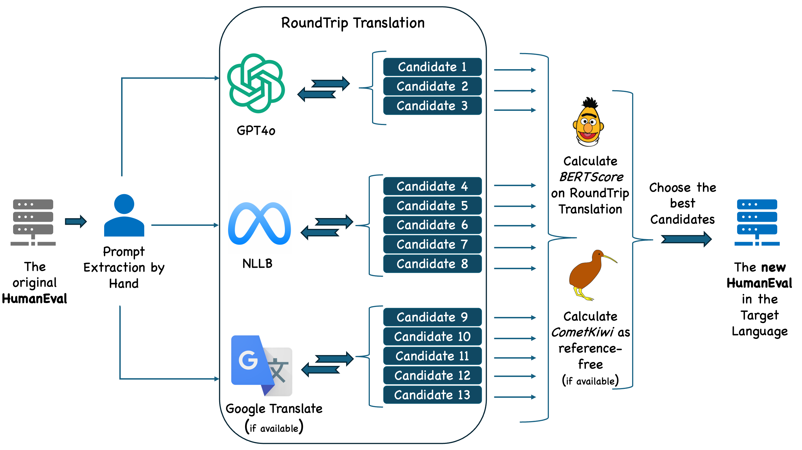

# **mHumanEval Overview**

The mHumanEval benchmark is curated based on prompts from the original HumanEval 📚 [Peng et al., 2024]. It includes a total of 33,456 prompts, significantly expanding from the original 164. 



**We have a total of 33,456 prompts in mHumanEval spanning 204 languages. Each prompt additionally supports 24 programming languages, bringing the total number of prompts to 836,400.**

We provide multiple subsets of the dataset for quick usability and interesting ablation studies. Separate subsets are available for each NL (Natural Language) and PL (Programming Language) in all possible combinations. Additionally, we create several variants for testing purposes:

- **mHumanEval-T500**: A subset consisting of the 500 highest-quality prompts based on BERTScore and CometKiwi.
- **mHumanEval-R500**: A randomly selected subset of 500 prompts.
- **mHumanEval-B500**: A subset of the 500 lowest-quality prompts.

These prompts are drawn from the curated mHumanEval, which compiles the best prompts from 13 candidates each. Finally, we produce **mHumanEval-mini**, a subset containing 204 prompts, with each prompt in a different language, selecting one prompt per language.

### mHumanEval Subsets 📊

| **Subset**             | **Prompts** | **Note**        |
|------------------------|-------------|-----------------|
| **mHumanEval-{NL}**    | 164 each    | Each NL         |
| **mHumanEval-mini**    | 204         | 204 NLs         |
| **mHumanEval-T500**    | 500         | Top 500         |
| **mHumanEval-R500**    | 500         | Random 500      |
| **mHumanEval-B500**    | 500         | Bottom 500      |
| **mHumanEval-{PL}**    | 4100 each   | Each PL         |
| **mHumanEval**         | 33,456      | Only Python     |
| **mHumanEval-Max**     | 836,400     | All Prompts     |

**Table: Subsets and Variants of mHumanEval.**

**Note:** Each subset and variant is designed to facilitate specific types of analysis and testing, ensuring comprehensive evaluation across different dimensions of the dataset.

---

## References 📚

```bibtex
@article{peng2024humaneval,
  title={HumanEval-XL: A Multilingual Code Generation Benchmark for Cross-lingual Natural Language Generalization},
  author={Peng, Qiwei and Chai, Yekun and Li, Xuhong},
  journal={arXiv preprint arXiv:2402.16694},
  year={2024}
}
